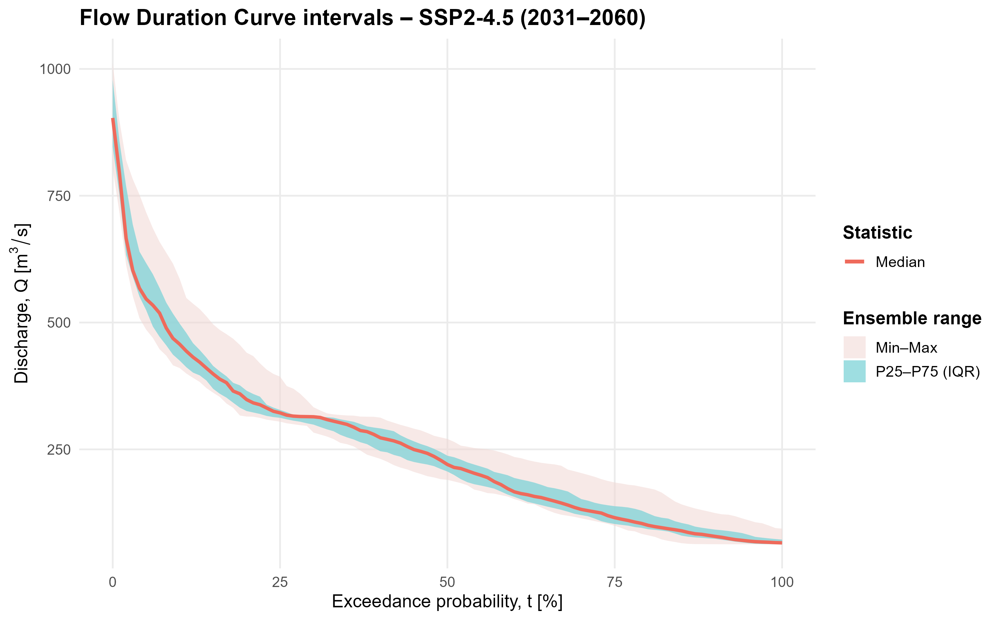
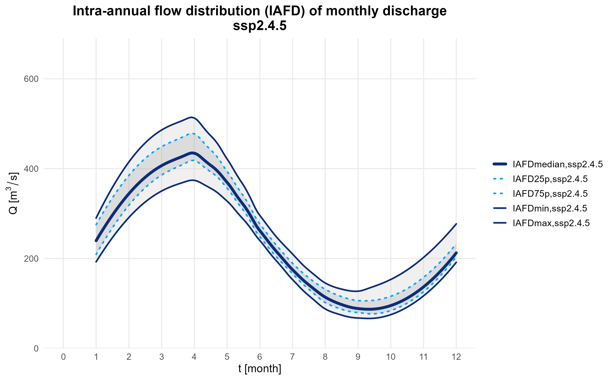

# Climate Change Impact Assessment in the Drina River Basin (CWatM)

This repository presents a fully reproducible workflow for assessing climate change impacts on the Drina River Basin using hydrological simulations from the CWatM model.

The analysis was developed within the framework of the Danube Water Balance project, focusing on changes in river discharge regimes under multiple climate scenarios and multi-model ensembles.

---

## Project overview

The workflow processes CWatM simulation outputs and derives a comprehensive set of hydrological and climate indicators to evaluate:

- Changes in flow regimes  
- Seasonal redistribution of discharge  
- Low-flow and high-flow behavior  
- Climate forcing impacts (precipitation, PET)  
- Flow Duration Curve (FDC) characteristics  

---

## Example outputs

### Flow Duration Curve (FDC)

### Intra-annual Flow Distribution (IAFD)

---

## Study design

- Hydrological model: CWatM  
- Study area: Drina River Basin  
- Climate dataset: Restore4Life  
- Climate models: 6 GCMs  
- Simulations: 24 runs  

### Scenarios

- historical  
- ssp126  
- ssp245  
- ssp585  

### Analysis periods

- Historical baseline: 1990–2014  
- Future period: 2031–2060  

---

## Repository structure

.
├── README.md
├── scripts/
├── functions/
├── docs/
├── data/
└── results/

---

## Workflow pipeline

Run the full workflow:

    source("scripts/01_run_pipeline.R")

### Steps

1. Build discharge thresholds  
2. Calculate discharge indicators  
3. Calculate monthly Intra-annual Flow Distribution (IAFD) metrics  
4. Calculate climate indicators  
5. Calculate Flow Duration Curve (FDC) metrics  
6. Compare scenarios  
7. Generate plots  

---

## Indicators

### Hydrological
- Q50, Q5, Q95  
- LFF, HFF  

### Climate
- AI (aridity index)  
- eta (runoff coefficient)  
- Mean annual precipitation  

### Seasonal
- Intra-annual Flow Distribution (IAFD)

### Flow regime
- Flow Duration Curve (FDC) metrics and curves  

---

## Outputs

results/
├── indicators/
├── fdc/
├── compare/
└── figures/

---

## Input data

Expected structure:

data/raw/restore4life/
├── historical/
├── ssp126/
├── ssp245/
└── ssp585/

---

## Requirements

See: docs/packages.md

---

## How to run

    source("scripts/01_run_pipeline.R")

---

## Reproducibility

The workflow is fully reproducible and script-based.  
All results and figures can be regenerated by executing the provided scripts.

---

## Acknowledgment

Developed within the Danube Water Balance project using CWatM simulations for the Drina River Basin.

I would also like to thank Andrijana Todorović, PhD, Assistant Professor at the Faculty of Civil Engineering, University of Belgrade, for her guidance and valuable advice during this work.
